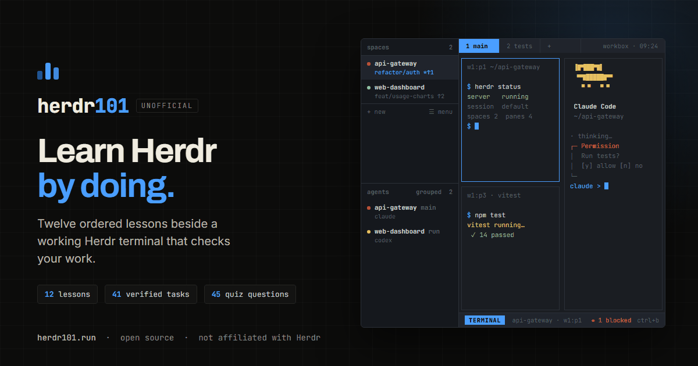

<div align="center">



# Herdr101

**Learn [Herdr](https://herdr.dev) by doing.** Twelve ordered lessons and quizzes beside a
working Herdr terminal simulator that checks your work.

[**herdr101.run**](https://herdr101.run) · [Report an issue](https://github.com/M0H4M3D-D3V/herdr101/issues) · [MIT licensed](LICENSE)

</div>

> [!IMPORTANT]
> **Herdr101 is unofficial.** It is a community learning project and is **not affiliated with,
> endorsed by, or maintained by the Herdr team.** The simulator imitates Herdr's behaviour for
> teaching purposes — it never connects to a real Herdr server, and it is not a substitute for
> the official documentation at [herdr.dev/docs](https://herdr.dev/docs/). Herdr is the property
> of its respective owners.

---

## What it is

Herdr is the runtime coding agents live on — it keeps real terminals running in a background
server so agents survive a closed laptop or a dropped connection. Herdr101 teaches that model
by making you use it.

The page is split in two. On the left, a lesson. On the right, a Herdr client you can actually
drive: type `herdr status`, split a pane with `ctrl+b v`, start an agent, watch it go
**blocked** waiting for your approval, detach and come back. The lesson watches what you do and
ticks its tasks off itself — you cannot click past them.

Everything runs in the browser. No install, no server, no account, nothing to configure.

## The course

| Module | Lessons |
| --- | --- |
| Ground rules | What Herdr actually is · Session, workspace, tab, pane |
| Panes and tabs | Splitting panes · Tabs: one layout per concern |
| Workspaces and projects | A workspace per project · Navigate mode |
| Agents | Running your first agent · Detection, labels and custom state |
| Staying alive | Detach, reattach, survive · Named sessions |
| Automation | Driving Herdr from a script · Configuration and plugins |

**12 lessons · 41 self-verifying tasks · 45 quiz questions.** Progress is saved in your browser.

## The simulator

It models Herdr rather than faking screenshots. Built to match the behaviour and visual
language documented at [herdr.dev/docs](https://herdr.dev/docs/):

- **Real structure** — session → workspace → tab → pane, with nested split layouts,
  draggable borders and `w1:p2` targets.
- **The sidebar Herdr draws** — two equal halves (`sidebar_section_split`), spaces rendering
  `["state_icon","workspace"]` / `["branch","git_status"]` and agents rendering
  `["state_icon","workspace","tab"]` / `["agent"]`, with real git branches per project.
- **Three input modes** — terminal, prefix (`ctrl+b`), navigate (`ctrl+b w`) — and the
  documented keymap: `v` `-` `c` `n` `p` `w` `shift+N` `x` `g` `z` `q`.
- **Agent lifecycle** — the five states (working / blocked / done / idle / unknown), approval
  prompts you answer with `y`/`n`, and state rolling up into the tab and the space.
- **Mouse-native** — click to focus, drag split borders, right-click panes, tabs and spaces for
  their menus, double-click a token to copy it.
- **Detach and survive** — `ctrl+b q`, reattach, named sessions, `herdr server stop`.
- **A filesystem worth exploring** — three projects (`api-gateway`, `web-dashboard`,
  `data-pipeline`) to `cd`, `ls`, `cat`, `tree`, `mv` and open spaces on, with tab completion
  and history.
- **The `herdr` CLI** — `status`, `workspace`, `tab`, `pane` (incl. `split`, `run`, `read`,
  `send`, `report-agent`), `agent` (incl. `wait`, `explain`, `rename`), `session`, `server`,
  `api schema`, `integration install`, `plugin list`.

Where fidelity and convenience conflict, fidelity wins: when an agent owns a pane it takes your
keystrokes, exactly as in real Herdr — so run the CLI from another pane (`ctrl+b v`). The
simulator tells you so if you forget.

## Run it locally

No build step and no dependencies. Clone and open the file:

```bash
git clone https://github.com/M0H4M3D-D3V/herdr101.git
cd herdr101
open index.html          # macOS  (Windows: start index.html)
```

Or serve it, which is closer to production and gives `localStorage` a real origin:

```bash
npm run serve            # http://localhost:5173
```

## Build a single file

```bash
npm run build
```

Inlines the CSS and JS into `dist/index.html` — one self-contained file you can host anywhere.
`dist/` is generated and git-ignored; the repository root is itself deployable as-is.

## Project layout

```
index.html              page shell, meta and link-preview tags
assets/
  css/app.css           the whole design system, one stylesheet
  js/vfs.js             in-memory filesystem (paths, files, git metadata)
  js/engine.js          session/workspace/tab/pane/agent model + event bus
  js/shell.js           shell built-ins and the herdr CLI
  js/sim.js             the client: sidebar, tabs, pane grid, modes, mouse
  js/tour.js            first-run offer and the guided walkthrough
  js/curriculum.js      the twelve lessons, tasks and quizzes
  js/app.js             lesson rendering, progress, quizzes, task checking
  img/                  link-preview image and icons
build.js                single-file bundler
```

The layering is deliberate and one-directional: `vfs` knows nothing about the engine, `engine`
knows nothing about the DOM, `sim` renders the engine, and `app` drives lessons from the events
the engine emits. Every state change goes through the engine and is published on its bus, which
is exactly how lesson tasks verify themselves.

## Adding a lesson

Push an object onto the right module in `assets/js/curriculum.js`:

```js
{
  id: 'my-lesson',
  title: 'Something worth knowing',
  body: '<h1>…</h1>' + code('example', ['$ herdr status']) + note('Tip', '<p>…</p>'),
  tasks: [
    { id: 't1', text: 'Do the thing', hint: 'how',
      check: (ev, scratch, engine) => ev.type === 'herdr.cmd' && ev.sub === 'status' }
  ],
  quiz: [ { q: '…', options: ['a', 'b', 'c', 'd'], answer: 2, why: '…' } ]
}
```

`check` receives every event the engine emits — `cmd`, `herdr.cmd`, `pane.split`, `pane.cwd`,
`tab.create`, `workspace.create`, `agent.start`, `agent.state`, `agent.waited`,
`session.detach`, `session.attach`, `fs.change`, `mode.change`, `server.reload` and more — plus
a per-task scratch object for multi-step checks and the live engine. Return `true` and the task
ticks itself off.

## Contributing

Issues and pull requests are welcome. Two ground rules keep this project honest:

1. **Match documented Herdr behaviour.** If you change how the simulator behaves, cite the
   [docs](https://herdr.dev/docs/) page that supports it in your PR description.
2. **Keep it dependency-free.** The site must stay openable from `file://` with no build step.

Please also keep the unofficial notices intact — they are what make this project fair to the
Herdr team.

## License

[MIT](LICENSE) © M0H4M3D-D3V

Herdr, the Herdr name and the Herdr documentation belong to their respective owners. This
project references them for educational purposes under fair use and claims no affiliation.
